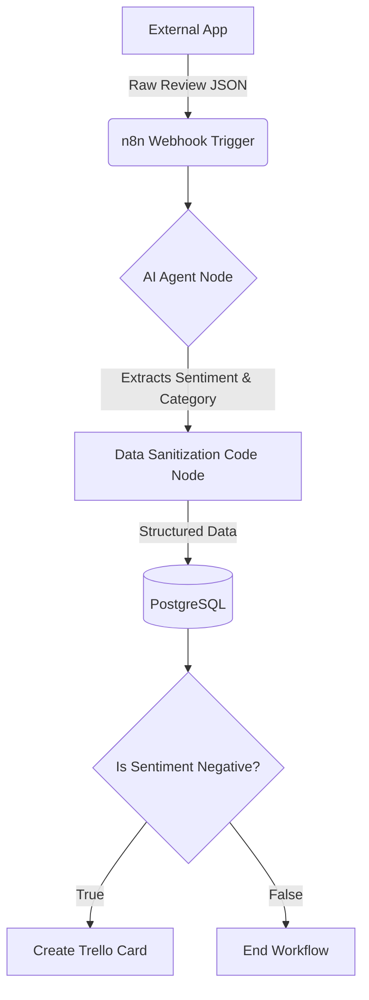

# 🚀 Automated Customer Feedback Sentiment Analysis Pipeline

An automated ETL and operational automation pipeline built with **n8n**. This system processes raw, unstructured customer reviews, analyzes their sentiment using AI (OpenAI-compatible LLMs), stores the structured insights into a PostgreSQL database, and automatically escalates negative feedback to a Trello board in real-time.

## 🏗️ Architecture



## 🛠️ Tech Stack
- **Frontend UI:** Vanilla HTML, CSS (Glassmorphism), JavaScript
- **Orchestrator:** n8n (Local via Docker)
- **AI Engine:** Groq / Llama / OpenAI-compatible API
- **Database:** PostgreSQL
- **Task Management:** Trello API

## 🚀 Getting Started (Local Setup)

This project uses Docker Compose for a seamless setup experience. 

### 1. Prerequisites
- Docker and Docker Compose installed
- Trello account (API Key & Token)
- LLM API Key (e.g., Groq API, OpenAI API)

### 🚀 How to Run Locally

1. Clone this repository:
   ```bash
   git clone https://github.com/username/customer-sentiment-pipeline.git
   cd customer-sentiment-pipeline
   ```

2. Configure environment variables:
   - Open the `.env` file (or copy `.env.example` to `.env`) and input your API Keys (OpenAI/Groq & Trello).
   - Ensure the database `POSTGRES_USER` and `POSTGRES_PASSWORD` are securely set.

3. Start the infrastructure using Docker:
   ```bash
   docker compose up -d
   ```
   *(PostgreSQL will automatically initialize the `customer_reviews` table using the `init.sql` script)*

4. **Setup n8n Workflow:**
   - Open `http://localhost:5679` in your browser.
   - Create a local account for the first time.
   - Go to **Workflows**, click **Add Workflow** -> Open the top-right menu -> **Import from File**.
   - Select the `n8n-workflow.json` file provided in this repository.
   - Make sure to connect your *Credentials* inside the nodes (OpenAI/Groq, PostgreSQL, and Trello).
   - Save and change the toggle to **Active** / **Publish**.

5. **Run the Frontend:**
   - Due to CORS restrictions on the `file://` protocol, you must use a Local Server to run the web interface.
   - If you have Node.js installed, run `npx serve frontend` in your terminal, or use the *Live Server* extension in VS Code.
   - Open `http://localhost:3000` (or your local server port) and submit your first review!

## 🧪 Testing the Pipeline
You can trigger the pipeline by sending a POST request to the n8n Webhook URL.

**Example Payload (Negative Review):**
```bash
curl -X POST http://localhost:5679/webhook/sentiment \
-H "Content-Type: application/json" \
-d '{"customer_name": "John Doe", "review_text": "The app keeps crashing when I try to upload a photo."}'
```
*Expected Result: Data inserted into PostgreSQL, and a new Trello Card created in the Escalation board.*

**Example Payload (Positive Review):**
```bash
curl -X POST http://localhost:5679/webhook/sentiment \
-H "Content-Type: application/json" \
-d '{"customer_name": "Jane Doe", "review_text": "I absolutely love the new dark mode!"}'
```
*Expected Result: Data inserted into PostgreSQL, workflow ends without creating a Trello ticket.*
